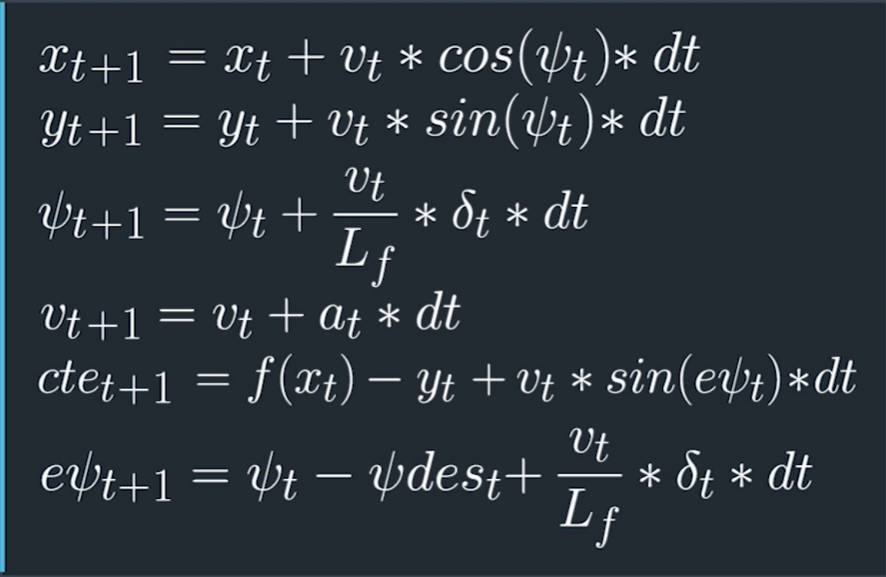

# Model Predictive Control (MPC) Project - Gaspard Shen
In this MPC project, I implement MPC to drive the simulator's Vehicle in the lake race as same previous PID control project. By using the MPC with cost function tuning and the N/dt hyperparameters, in the end the Vehicle can drive the whole lap in the lake race.

## Implementation
- **_The Model_**
  - The model we use in the lecture was global kinematic model which are simplifications of dynamic models that ignore tire forces, gravity, and mass. The simplification reduces the accuracy of the models, but it also makes them more tractable. Below picture are the detail how this model based on the previous state and current actuator inputs.

- **_Timestep Length and Elapsed Duration (N & dt)_**
  - The product of N and dt define the prediction horizon which is the duration over which future prediction are made as T. In the the lecture suggestion T should be as large as possible and the dt should be as small as possible. However, it also impact the performance of model. In the end, I chosen N as 10 and dt as 0.1. Which means the T prediction horizon is 1 sec. I have tired N 20 with dt 0.2, sometime the car will run out of the road.
- **_Polynomial Fitting and MPC Preprocessing_**
  - The waypoints are preprocesses by transforming the vehicle's perspective angle int `main.cpp 97~104` lines.
- **_Model Predictive Control with Latency_**
  - To handles a 100 millisecond latency, i will use the previous time state to calculate the constraints at `MPC.cpp 89~92` lines.

## Simulation
Below was the video link on my vimeo of the end result of the MPC project. The car can run smooth and without running out of roads.

https://vimeo.com/266165238
